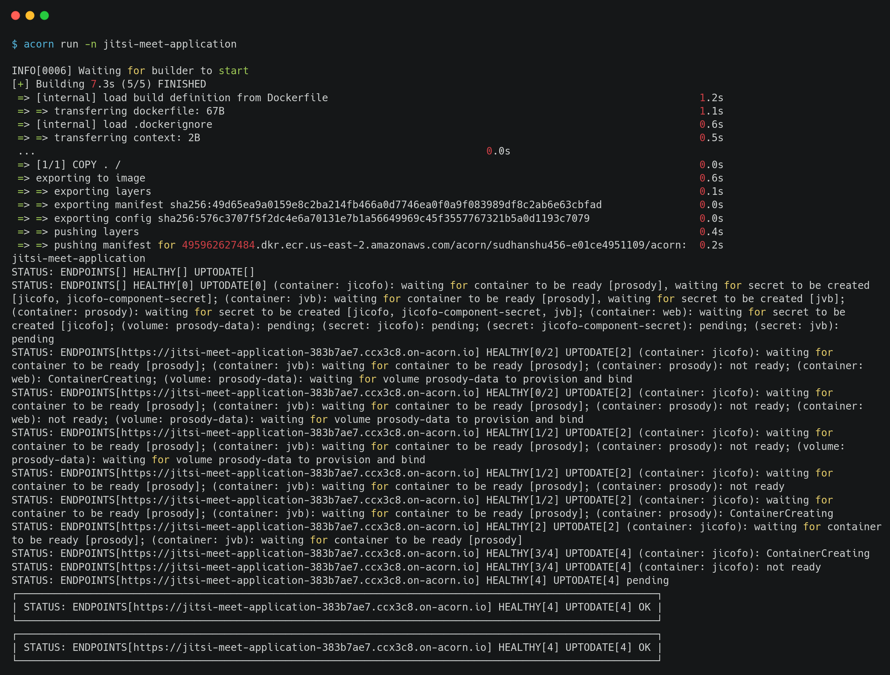

# Doing More with Jitsi Meet on Acorn: Your Own Video Conferencing Solution

In an era where video conferencing is not just a convenience but a necessity, many of us have experienced the constraints of mainstream platforms. These platform often limit anonymity, restrict participation number and so on with hefty fees, and lack customization options. This is particularly frustrating when you want to host inclusive meetings, whether it's for internal company briefings, community meetups, or open-source project collaborations, or for just fun. That’s where Jitsi Meet, an open-source video conferencing solution, emerges as a game-changer.

Jitsi Meet stands out by offering what many platforms don’t: the freedom to allow anonymous users to join meetings, create and share meeting links effortlessly, and even customize meeting URLs for easy access. For businesses, communities, and individual users who crave flexibility, Jitsi Meet provides a much-needed breath of fresh air. It empowers you to tailor the solution to your specific needs, thanks to its open-source nature.

Deploying Jitsi Meet might seem daunting, given the usual technical complexities of setting up such a versatile solution. However, this is where Acorn steps in, simplifying the building & deployment process. Acorn, an cloud platform, makes building, sharing, and deploying containerized apps straightforward, turning a potentially complex task into a user-friendly experience.

The [Acorn Cloud Platform](https://www.acorn.io/) takes ease of deployment to the next level. By offering a free [sandbox environment](https://docs.acorn.io/sandbox), it allows you to run your 'acorns'—the containerized versions of your applications—without any cost or commitment. This sandbox feature is perfect for testing and fine-tuning your Jitsi Meet setup and the best part? You can also host these applications for short bursts, like a quick 2-hour session, perfect for those spur-of-the-moment meetings or tech experiments.

You can even share your application with others through a simple link, enabling effortless deployment with just a single click. This convenience is good for experimenting with Jitsi Meet Meet on Acorn, allowing you to run your applications for up to two hours at a time, providing ample opportunity to evaluate and refine your video conferencing solution. If you wish to [run your Production workloads](https://docs.acorn.io/aws/overview), upgrade to a teams and enterprise plan to deploy and manage applications in your AWS account. Deploying on Acorn is simple as defining your application with an [Acornfile](https://docs.acorn.io/reference/acornfile), generating a deployable Acorn Image.

In this tutorial, we will see how we deploy Jitsi Meet in just few steps. If you wish to proceed directly to the end, simply click the button below _Run in Acorn_ and launch the app immediately in a free sandbox environment. All you need to join is a GitHub ID for account creation.

[](https://acorn.io/run/ghcr.io/infracloudio/jitsi-meet-acorn:v%23.%23.%23-%23?ref=sudhanshu456&name=Jitsi+Meet+Application)

To learn how to write your own Acornfile to deploy Jitsi Meet or further customise, follow along:

> _Note: Everything shown in this tutorial can be found in [this repository](https://github.com/infracloudio/jitsi-meet-acorn)._

## Pre-requisites

- [Acorn CLI](https://docs.acorn.io/installation/installing)
- Github account to sign up for the Acorn Platform.

## Acorn Login

Login to the [Acorn Platform](http://www.acorn.io) using the Github Sign-In option with your Github user.


After the installation of Acorn CLI for your OS, you can login to the Acorn platform.

```
acorn login
```

## Deploy your Jitsi Meet

We will be deploying a Jitsi Meet application for video Conferencing. You can find the source code for the Acorn of this sample application [here](https://github.com/infracloudio/jitsi-meet-acorn).

There are two ways you can deploy this Jitsi Meet application.

- Using Acorn platform dashboard.
- Using CLI

The first way is the easiest one where, in just a few clicks you can deploy the Jitsi Meet application to the platform and start using it. However, if you want to customize the application or want to understand how you can run your own Jitsi Meet applications using Acorn, use the second option.

## Running Jitsi application using Dashboard

We can run our application from an existing image from the Acorn Cloud Platform UI by clicking on the _”Deploy Acorns”_ button.

Choose the source for deploying your Acorns


On the “Deploy an Acorn” page, provide a name such as _Jitsi Application_ and type in the below Pre-built Acorn image and choose Create.

> Note: If you have your own custom Acorn image, you can also provide that.

```sh
ghcr.io/infracloudio/jitsi-meet-acorn:v#.#.#-#
```


Now, the sample application has been provisioned on the Acorn Platform and is available for Two hours. You can choose to upgrade to an enterprise account to keep it running longer.


Once the Acorn status comes to `Running`, you can open up the Jitsi Meet application on the given endpoint link, showing below three vertical dots, right after running status.


## Running the Jitsi Meet application using acorn CLI

Running your own customized Jitsti Meet application through the CLI method is a great way to understand Acornfile. Additionally, you can customize the application according to your requirements, or apply your Acorn knowledge to operate your own Jitsi application.

To run the Jitsti Meet application using CLI, let’s start by cloning its source repository.

```sh
git clone https://github.com/infracloudio/jitsi-meet-acorn.git
```

Here’s the folder structure overview for the sample application.

```sh
.
├── Acornfile
├── assets
├── jitsi-meet-icon.png
├── LICENSE
├── README.md
└── tutorial.md
```

### Acornfile

This is where all the Acorn configuration lives. The Acornfile describes the containers, arguments, secrets and volumes to deploy the application. During the Acorn build all of the Docker containers will be built or pulled from a registry and packaged into the Acorn image.

```bash
name:        "Jitsi Meet Acorn"
description: "Hosting a video conferencing solution on Acorn"
readme:      "./README.md"
icon:        "./jitsi-meet-icon.png"

args: {
  // Your local timezone ID e.g. America/Los_Angeles, Europe/London, etc. Default is America/Los_Angeles.
  TZ: ""
}

containers: {
  jicofo: {
    image: "jitsi/jicofo:stable-9111"
    ports: ["8888:8888", "80:80"]
    env: {
      JICOFO_AUTH_USER: "secret://jicofo/username"
      JICOFO_AUTH_PASSWORD: "secret://jicofo/password"
      JICOFO_COMPONENT_SECRET: "secret://jicofo-component-secret/token"
      XMPP_AUTH_DOMAIN: "auth.meet.jitsi"
      XMPP_INTERNAL_MUC_DOMAIN: "internal-muc.meet.jitsi"
      XMPP_MUC_DOMAIN: "muc.meet.jitsi"
      XMPP_RECORDER_DOMAIN: "recorder.meet.jitsi"
      ENABLE_COLIBRI_WEBSOCKET: "false"
      ENABLE_XMPP_WEBSOCKET: "false"
      PUBLIC_URL: "meet.jitsi-acorn.com"
      TZ: std.ifelse(args.TZ != "", args.TZ, "America/Los_Angeles")
      XMPP_DOMAIN: "meet.jitsi"
      XMPP_GUEST_DOMAIN: "guest.meet.jitsi"
      ENABLE_AUTH: "0"
      ENABLE_GUESTS: "1"
      JVB_BREWERY_MUC: "jvbbrewery"
      XMPP_SERVER: "prosody.@{acorn.namespace}.svc.cluster.local"
    }
    dependsOn: ["prosody"]
  }
  jvb: {
    image: "jitsi/jvb:stable-9111"
    ports: ["10000:10000/udp"]
    env: {
      JVB_AUTH_USER: "secret://jvb/username"
      JVB_AUTH_PASSWORD: "secret://jvb/password"
      ENABLE_AUTH: "0"
      ENABLE_GUESTS: "1"
      PUBLIC_URL: "meet.jitsi-acorn.com"
      XMPP_DOMAIN: "meet.jitsi"
      XMPP_MUC_DOMAIN: "muc.meet.jitsi"
      XMPP_AUTH_DOMAIN: "auth.meet.jitsi"
      XMPP_GUEST_DOMAIN: "guest.meet.jitsi"
      XMPP_RECORDER_DOMAIN: "recorder.meet.jitsi"
      XMPP_INTERNAL_MUC_DOMAIN: "internal-muc.meet.jitsi"
      ENABLE_COLIBRI_WEBSOCKET: "false"
      ENABLE_XMPP_WEBSOCKET: "false"
      TZ: std.ifelse(args.TZ != "", args.TZ, "America/Los_Angeles")
      JVB_BREWERY_MUC: "jvbbrewery"
      JVB_PORT: "10000"
      JVB_STUN_SERVERS: "meet-jit-si-turnrelay.jitsi.net:443"
      JVB_TCP_HARVESTER_DISABLED: "1"
      XMPP_SERVER: "prosody.@{acorn.namespace}.svc.cluster.local"
      COLIBRI_REST_ENABLED: "true"
    }
    dependsOn: ["prosody"]
  }
  web: {
    image: "jitsi/web:stable-9111"
    ports: publish: ["80/http"]
    env: {
      DISABLE_HTTPS: "1"
      ENABLE_HTTP_REDIRECT: "0"
      JICOFO_AUTH_USER: "secret://jicofo/username"
      XMPP_BOSH_URL_BASE: "http://prosody.@{acorn.namespace}.svc.cluster.local:5280"
      ENABLE_AUTH: "0"
      ENABLE_GUESTS: "1"
      PUBLIC_URL: "meet.jitsi-acorn.com"
      XMPP_DOMAIN: "meet.jitsi"
      XMPP_MUC_DOMAIN: "muc.meet.jitsi"
      XMPP_AUTH_DOMAIN: "auth.meet.jitsi"
      XMPP_GUEST_DOMAIN: "guest.meet.jitsi"
      XMPP_RECORDER_DOMAIN: "recorder.meet.jitsi"
      XMPP_INTERNAL_MUC_DOMAIN: "internal-muc.meet.jitsi"
      ENABLE_COLIBRI_WEBSOCKET: "false"
      ENABLE_XMPP_WEBSOCKET: "false"
      TZ: std.ifelse(args.TZ != "", args.TZ, "America/Los_Angeles")
    }
  }
  prosody: {
    image: "jitsi/prosody:stable-9111"
    ports: expose: ["5222:5222","5269:5269","5347:5347","5280:5280/http","5281:5281/http"]
    dirs: {
      "/config/data": "volume://prosody-data"
    }
    env: {
      JICOFO_AUTH_USER: "secret://jicofo/username"
      JICOFO_AUTH_PASSWORD: "secret://jicofo/password"
      JICOFO_COMPONENT_SECRET: "secret://jicofo-component-secret/token"
      JVB_AUTH_USER: "secret://jvb/username"
      JVB_AUTH_PASSWORD: "secret://jvb/password"
      ENABLE_AUTH: "0"
      ENABLE_GUESTS: "1"
      PUBLIC_URL: "meet.jitsi-acorn.com"
      XMPP_DOMAIN: "meet.jitsi"
      XMPP_MUC_DOMAIN: "muc.meet.jitsi"
      XMPP_AUTH_DOMAIN: "auth.meet.jitsi"
      XMPP_GUEST_DOMAIN: "guest.meet.jitsi"
      XMPP_RECORDER_DOMAIN: "recorder.meet.jitsi"
      XMPP_INTERNAL_MUC_DOMAIN: "internal-muc.meet.jitsi"
      ENABLE_COLIBRI_WEBSOCKET: "false"
      ENABLE_XMPP_WEBSOCKET: "false"
      TZ: std.ifelse(args.TZ != "", args.TZ, "America/Los_Angeles")
    }
  }
}

secrets: {
  "jicofo-component-secret": type: "token"

  jicofo: {
    name: "credentials of the jicofo user"
    type: "basic"
    params: {
      passwordLength:     10
      passwordCharacters: "A-Za-z0-9"
    }
    data: {
      username: "jicofo"
      password: ""
    }
  }
  jvb: {
    name: "credentials of the jvb user"
    type: "basic"
    params: {
      passwordLength:     10
      passwordCharacters: "A-Za-z0-9"
    }
    data: {
      username: "jvb"
      password: ""
    }
  }
}

volumes: {
    "prosody-data": {}
}
```

Here’s a quick description of the Acornfile above. For a full overview of the Acornfile specification please see Acorn [documentation](https://docs.acorn.io/authoring/overview).

- `containers`: section describes the set of containers your Acorn app consists of.
- `ports`: using the publish type, we expose the app outside the cluster using an auto-generated ingress resource
- `dirs`: Directories to mount into the container filesystem
- `services`: defines cloud services that will be provisioned for your application.
- `args`: this allowes allow users to provide input at different points in the Acorn lifecycle.
- `env`: environment variables, referencing a secret or referencing an Acorn argument
- `volumes`: define volumes which will be bounded to containers, sidecars, or jobs, wherever the persistence is required.
- `consumes`: It helps in defining which service is required for container to run.
- `secrets`: Acorn provides multiple secret types, and makes it easy to create closed loop systems where information can be kept within the defined Acorn.

### Deploy your Application

We will now deploy your application to the Acorn Platform. The following command will build and run the Acorn on the hosted platform in a single step. Since we’ve already logged in to the platform in the previous step, this command will talk to the platform to build and deploy your application. For production deployments you will want to build the image and push it to a registry.

From the same folder as your Acornfile, run :

```sh
acorn run -n jitsi-meet-application
```

Once the application is running successfully, it will output a URL for the application endpoint.



Also on the Acorn Platform Dashboard you should see it being deployed.


## Using the application

Once you follow one of the above methods of deploying the Jitsi Meet, you’ll get a endpoint in the Acorn dashboard or in the CLI output, that will help you reach to your application in browser.

For this sample deployment the endpoint url is `https://jitsi-meet-application-383b7ae7.ccx3c8.on-acorn.io/`


1. Jitsi Meet application home page.
    
2. Create and Join Meeting
    
3. Joined Meeting Preview
    

## Acorn Dashboard

The Acorn Dashboard is integrated with multiple features such as Events, Logs, Details and accessing the Shell of the Application. Details include the CPU, Memory, Network, and Errors for the Application.


> Explore various available options by clicking the Menu option on your Acorn App and to access the Acorn Dashboard head to [Acorn.io](https://www.acorn.io/) and login with your credentials.

## Development Mode

In development mode, Acorn will watch the local directory for changes and synchronize them to the running Acorn app. In general, changes to the Acornfile are directly synchronized, e.g. adding environment variables, etc. Depending on the change, the deployed containers will be recreated.

If you've defined a line `if args.dev { dirs: "/app": "./" }` in the Acornfile, it will enable hot-reloading of code by mounting the current local directory into the app container.

You will see the change applied when you reload the application's page in your browser, in case of Jitsi, we don't have any application code, except Acornfile, which will be by default on watch if you run dev mode.

## How to Build and Push an artifact to a registry

Once you're done with the changes, and application is working as expected, you can proceed to build and packaging to a registry, later the acorn image can be used directly in the Acorn platform using the dashboard, as described earlier in running the application using Dashboard.

To understand how this works, let assume you want to push it to GCR(GitHub Container Registry).

### Log in to the registry

Before building and you need to login to the desired container registry you wish to push. In below example we're logging into GitHub Container Registry.

```sh
acorn login ghcr.io
```

### Build and push the image

After, login you can build, tag and push the image using the below command.

```sh
acorn build -t ghcr.io/infracloudio/jitsi-meet-acorn:v0.0.0.1 --push
```

## What's Next?

1. Any app provisioned under Acorn sandbox region is available for only 2hrs, in order to keep it running longer you need to upgrade to Pro account.
2. After deploying you can edit the Acorn Application or remove it if no longer needed. Click the Edit option to edit your Acorn's Image. Toggle the Advanced Options switch for additional edit options.
3. Remove the Acorn by selecting the Remove option from your Acorn dashboard.

## Conclusion

In this tutorial, we have learned how to deploy a Jitsi Meet application on Acorn Platform by defining cloud services information into an Acornfile. Then we explored the Acorn Platform Dashboard to gain useful insights of deployed application.

Lastly, we saw an example to build and push changes to registry, which later can be directly used in Acorn Platform.
